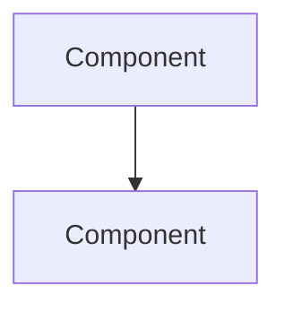

# Architecture

## System Overview
[High-level description of the system]

## Architectural Style
[Monolithic / Microservices / Serverless / Hybrid — with evidence]

## Component Relationships

## Data Flow
[How data moves through the system, entry to persistence]

## Interaction Diagrams
[Sequence or flow diagrams showing how the main business transactions are implemented across components — one per key transaction]

## Key Design Decisions
[Notable architectural choices and their implications]

## Improvement Opportunities
[Areas where the architecture could be strengthened; coupling hotspots, missing boundaries]
