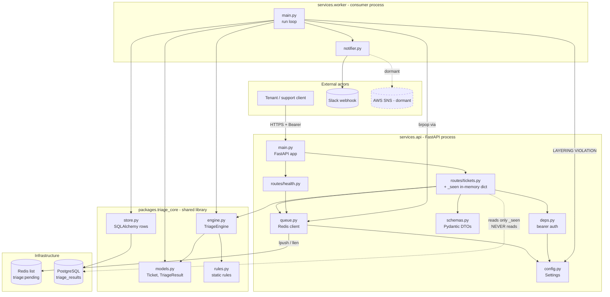
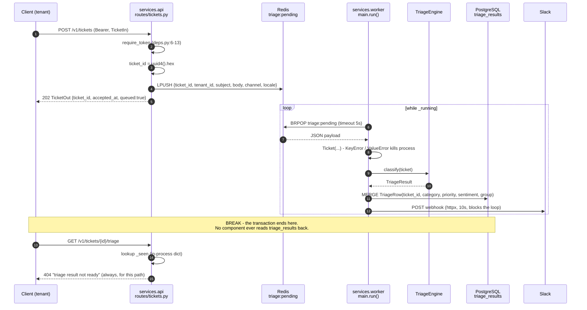
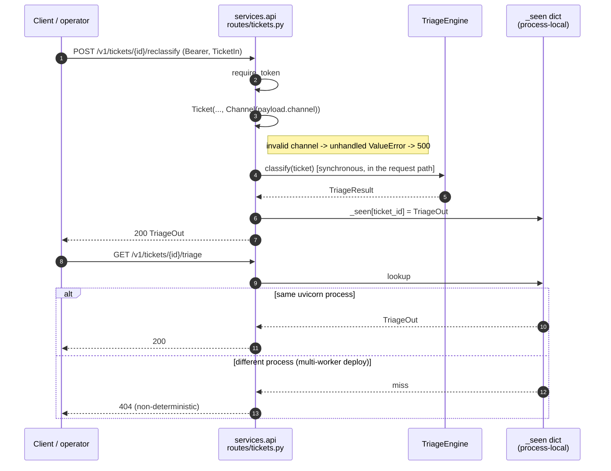
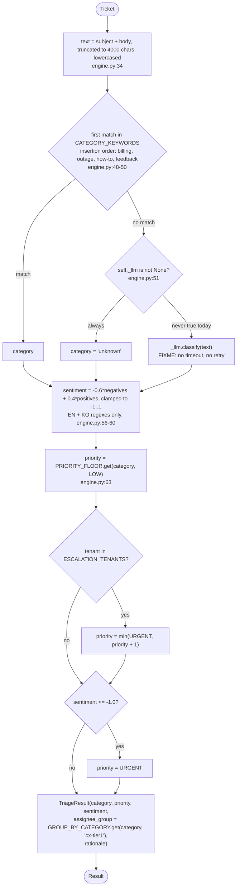

# Architecture

## System Overview

`ticket-triage` is a small two-process Python system built around a Redis work
queue:

- **`services.api`** — a FastAPI HTTP service that accepts tickets, enqueues
  them, serves triage lookups, offers a synchronous reclassify operation, and
  exposes liveness/readiness probes.
- **`services.worker`** — a long-running consumer process that pops queued
  tickets, classifies them with the shared engine, persists the result to a
  relational database, and notifies downstream channels.
- **`packages.triage_core`** — a dependency-free (except SQLAlchemy) shared
  library holding the domain models, the static routing rules, the triage
  engine, and the persistence layer. Both services import it.

Infrastructure (Redis, PostgreSQL) is declared in `infra/docker-compose.yml`;
CI is a three-stage GitLab pipeline (`.gitlab-ci.yml`).

Total application source is ~495 lines across 18 files — this is a small
codebase whose architectural problems are structural, not volume-related.

## Architectural Style

**Hybrid: two-service, queue-mediated (event-driven-ish) architecture over a
shared library — with a broken layering boundary and an incomplete CQRS-like
read/write split.**

Evidence and qualifications:

- *Queue-mediated asynchronous processing*: `POST /v1/tickets` returns 202 after
  an `lpush` (`routes/tickets.py:18-22`, `queue.py:11-12`); the worker `brpop`s
  in a loop (`worker/main.py:32-33`, `queue.py:15-17`). Producer and consumer
  never call each other directly.
- *Shared-library core, not microservices*: both services import the same
  in-process `triage_core` package, share one database, and share
  `services/api/config.py`. There is no per-service data ownership, no service
  API between them, and no independent deployability — so this is **not**
  microservices despite the two-process split. It is closer to a **distributed
  monolith**: two deployables that cannot evolve independently.
- *Accidental CQRS without the projection*: writes go through the worker to
  `triage_results`; reads go to an in-process dict. The read model exists, the
  write model exists, and **nothing connects them** (see Data Flow).
- *Layering violation*: `services/worker/main.py:12-13` imports
  `services.api.queue` and `services.api.config`, i.e. the worker depends on
  the API service package rather than on a neutral shared infrastructure module.
  This is the single largest obstacle to deploying or scaling the two services
  independently.
- *No hexagonal boundary*: `triage_core.engine` is pure and testable, but
  `triage_core.store` binds the core to SQLAlchemy, and infrastructure clients
  are constructed at import time (`queue.py:8`, `notifier.py:10`), so no port /
  adapter seam exists.

## Component Relationships



The dashed `routes/tickets.py -.-> PostgreSQL` edge is the missing link: it is
drawn to show what the architecture *implies* but does not implement.

## Data Flow

### Write path (works)

`client → POST /v1/tickets` → `require_token` → `TicketIn` validation →
`uuid4().hex` id minted → JSON `{ticket_id, tenant_id, subject, body, channel,
locale}` → `LPUSH triage:pending` → 202 `TicketOut` returned.
The worker `BRPOP`s the item (5 s timeout), rebuilds a `Ticket`, calls
`TriageEngine.classify`, `session.merge(TriageRow(...))` + commit, then
`Notifier.notify`.

**The ticket body itself is never persisted** — `TicketRow` (`store.py:10-17`)
is never instantiated. Once the worker pops the message, the original content
exists nowhere.

### Read path (broken)

`client → GET /v1/tickets/{id}/triage` → `require_token` → lookup in the
module-level dict `_seen` (`routes/tickets.py:15`) → 404 if absent.
`_seen` is populated at exactly one place: `routes/tickets.py:51`, inside
`reclassify`. Therefore:

- a ticket that went through the normal ingest path returns **404 forever**;
- a ticket that was reclassified returns 200 — but only from the uvicorn worker
  process that served the reclassify call, since `_seen` is per-process;
- the `triage_results` rows the worker writes are **never read by any code**.

### Reclassify path (works, but bypasses the pipeline)

`POST /v1/tickets/{id}/reclassify` constructs a `Ticket` from the request body
and runs `TriageEngine.classify` **synchronously inside the HTTP request**,
caches the result in `_seen`, and returns it. It never touches Redis or the
database. It is currently the only way to obtain a 200 from the triage GET.

### Configuration flow

`config.py:5-14` reads all environment variables as **dataclass default
values**, which Python evaluates once at class-definition (import) time. The
resulting `settings` singleton cannot be re-read or overridden without
reimporting the module.

## Interaction Diagrams

### T1 — Ingest and triage a ticket (the advertised end-to-end transaction)



### T2 — Reclassify a ticket (the only path that yields a readable result)



### T3 — Classification decision flow (inside `TriageEngine.classify`)



### T4 — Readiness probe

```mermaid
sequenceDiagram
  autonumber
  participant K as Orchestrator / LB
  participant A as services.api<br/>routes/health.py
  participant R as Redis

  K->>A: GET /readyz (no auth)
  A->>R: LLEN triage:pending
  alt Redis reachable
    R-->>A: depth
    A-->>K: 200 {status:"ok", queue_depth:n}
  else Redis down
    R-->>A: ConnectionError (unhandled)
    A-->>K: 500 Internal Server Error
  end
  Note over A: /readyz can never return a "not ready" body;<br/>failure surfaces only as an unhandled 500.
```

## Key Design Decisions

| # | Decision | Where | Implication |
|---|---|---|---|
| D1 | Accept-then-queue (202) instead of synchronous triage | `routes/tickets.py:18-22` | Good: fast ingest, absorbs bursts. Requires a working read-back path — which is missing. |
| D2 | Redis list as the broker (`lpush`/`brpop`) | `queue.py` | Simple and dependency-light, but no acknowledgement, no retry, no dead-letter: `brpop` removes the item before any processing succeeds, so a crash loses the ticket. |
| D3 | Untyped JSON dict as the queue contract | `queue.py:11-17` ↔ `worker/main.py:36-43` | The two services already share Pydantic models and dataclasses, yet the wire format between them is schemaless. A malformed message raises `KeyError` and kills the consumer. |
| D4 | Shared `triage_core` library rather than a triage service | `packages/triage_core/` | Keeps the domain logic in one place and makes it unit-testable; costs independent deployability and forces version lock-step. |
| D5 | Worker reuses `services.api.queue` / `services.api.config` | `worker/main.py:12-13` | Layering violation. The queue client and settings belong in a neutral module (e.g. `packages/triage_infra/`). |
| D6 | Static, code-resident business rules | `rules.py` | Fast and auditable via git, but every rule change is a deploy — and the module is declared exempt from review (`rules.py:1`). |
| D7 | Rules keyed by dict insertion order (first match wins) | `engine.py:48-50` | Silent precedence: a ticket matching both "refund" and "down" is always `billing`, never `outage`. Undocumented and untested. |
| D8 | Infrastructure clients built at import time | `queue.py:8`, `notifier.py:10`, `config.py:7-11` | Makes the service modules unimportable without live infrastructure (and, for `boto3.client("sns")`, without AWS credentials). This is the structural cause of zero service-layer test coverage. |
| D9 | `Base.metadata.create_all` at worker start, no migrations | `store.py:29-32` | No path to evolve the schema against an existing database; schema creation is a side effect of a worker deploy. |
| D10 | Single static shared bearer token | `deps.py:6-13`, `config.py:10` | Defaults to the literal `"dev-token"`; no per-tenant scoping and no ownership checks on any route. |
| D11 | `TriageEngine` owns classification, sentiment, priority and routing | `engine.py:26-68` | Self-flagged god object (`engine.py:3-5`); named as the blocker for the planned multilingual path. |
| D12 | Version string duplicated | `pyproject.toml:3` and `main.py:5` | Will drift; the OpenAPI document can silently disagree with the package. |

## Improvement Opportunities

Ordered by architectural leverage.

1. **Close the read path (highest priority).** Make
   `GET /v1/tickets/{id}/triage` query `TriageRow` through a session factory
   injected as a FastAPI dependency, and delete `_seen`. This single change
   makes the advertised architecture real and simultaneously removes the
   in-memory-state and multi-process-inconsistency defects. It forces a
   deliberate decision on whether `reclassify` should persist through the same
   store (recommended) or be removed.
2. **Break the worker → API dependency.** Move `queue.py` and `config.py` into
   a neutral package (e.g. `packages/triage_infra/`) that both services import.
   Until this is done the two services are one deployable in disguise.
3. **Give the queue a schema.** Define a Pydantic `QueuedTicket` model in the
   shared package and validate on both ends; it removes the duplicated `Ticket`
   construction in `routes/tickets.py:34-42` and `worker/main.py:36-43` and
   turns a consumer-killing `KeyError` into a rejectable message.
4. **Make the worker loop fault-tolerant.** Wrap the body in try/except with
   structured logging, add a dead-letter list, and use a reliable pattern
   (`BRPOPLPUSH`/`LMOVE` into a processing list) so a crash does not lose the
   ticket. Today any bad payload, DB error, or Slack failure terminates the
   process (`worker/main.py:32-56`).
5. **Move notification off the consumer path.** `httpx.post` with a 10 s timeout
   inside the loop (`notifier.py:21-23`) makes queue throughput hostage to
   Slack's latency. Publish to a secondary queue or use an async client with a
   bounded worker pool, plus retry/backoff.
6. **Invert the infrastructure dependencies.** Replace import-time clients and
   env-as-dataclass-defaults with factory functions / a `Settings` constructed
   at startup. This is a prerequisite for any meaningful test of `services.api`
   or `services.worker`.
7. **Introduce a tenant boundary.** Scope tokens (or claims) to a tenant and
   compare against the stored `tenant_id` on both `/{id}/triage` and
   `/{id}/reclassify`. Persist the ticket (`TicketRow`) so the check has
   something to compare against.
8. **Split `TriageEngine`.** Separate `Categorizer`, `SentimentScorer`, and
   `Router` behind small interfaces — the precondition the code itself records
   for multilingual support (`engine.py:3-5`).
9. **Add migrations (Alembic)** and drop `create_all` from the worker startup
   path; reconcile the SQLite default (`config.py:7`) with the Postgres URL in
   compose and declare the `psycopg` driver.
10. **Make deployment real.** There is no Dockerfile, yet CI's build stage and
    both compose services build from `.` — deployment is broken as committed.

### Coupling hotspots and missing boundaries

- **High fan-in**: `services/api/config.py` (imported by `queue.py`, `deps.py`,
  `worker/main.py`) and `packages/triage_core/models.py` (imported by
  `engine.py`, `rules.py`, `routes/tickets.py`, `worker/main.py`, both tests).
  The former is the wrong module to be a hub.
- **High fan-out**: `services/worker/main.py` imports six modules across three
  packages and is the only place the whole pipeline is assembled.
- **Missing boundary — shared mutable state**: `_seen`
  (`routes/tickets.py:15`) is module-global mutable state in a service that is
  expected to run multi-process.
- **Missing boundary — no repository/port**: persistence is reached by
  constructing SQLAlchemy sessions inline in the worker loop
  (`worker/main.py:45-55`); there is no repository interface to substitute in a
  test or to reuse from the API.
- **No circular imports** were detected; the dependency graph is acyclic.
