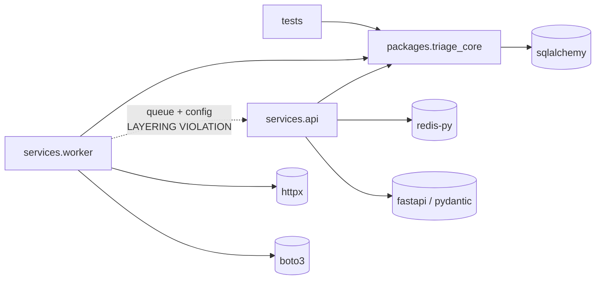

# Dependencies

## External Dependencies

Declared in `pyproject.toml`. All are exact-pinned (`==`); there is **no
lockfile**, so transitive dependencies float.

### Runtime (`[project].dependencies`)

| Package | Pinned | Purpose | Used at | Risk notes |
|---|---|---|---|---|
| `fastapi` | `0.111.0` | HTTP framework, DI, OpenAPI | `services/api/main.py`, `routes/*`, `deps.py` | Pin is from mid-2024 and several minor versions behind current; no security advisory known for this line, but the gap is large enough that upgrades will need testing the repo cannot currently provide. |
| `uvicorn[standard]` | `0.30.1` | ASGI server | run command (`README.md:7`) | Pulls a large `[standard]` extra set (uvloop, httptools, watchfiles, python-dotenv, PyYAML) that is unpinned transitively. |
| `pydantic` | `2.7.1` | Request/response validation | `services/api/schemas.py` | Pydantic v2 line; fine. Compiled `pydantic-core` must match the interpreter — relevant when the missing Dockerfile is written. |
| `sqlalchemy` | `2.0.30` | ORM + engine | `packages/triage_core/store.py` | On 2.0 but written in **1.x style** (`declarative_base()`, `Column(...)` rather than `DeclarativeBase` + `Mapped[]`), so the typing benefits of 2.0 are unused. |
| `redis` | `5.0.4` | Queue client | `services/api/queue.py` | Single-module usage; sync client only. |
| `httpx` | `0.27.0` | Slack webhook POST | `services/worker/notifier.py:23` | **Whole dependency for one call.** Used synchronously; `requests`-free but also async-capable and not exploited. |
| `boto3` | `1.34.100` | AWS SNS publish | `services/worker/notifier.py:10,20` | **Heaviest dependency in the tree (boto3 + botocore + s3transfer) for a code path that is unreachable** — the worker never passes `topic_arn`. `boto3.client("sns")` still runs at import (`notifier.py:10`) and requires a resolvable region. Strong removal candidate. |

**Undeclared but required**: a PostgreSQL driver. `infra/docker-compose.yml:7`
supplies `postgresql+psycopg://…`, which needs `psycopg[binary]` (psycopg 3) —
it appears nowhere in `pyproject.toml`. As committed, the worker cannot connect
to the compose database.

### Development (`[project.optional-dependencies].dev`)

| Package | Pinned | Purpose | Risk notes |
|---|---|---|---|
| `pytest` | `8.2.0` | Test runner | Fine. |
| `pytest-asyncio` | `0.23.6` | — | **Unused** — no async tests exist. Dead dependency. |
| `ruff` | `0.4.4` | Linter | Very old for ruff's release cadence; configured without a `select`, so only the default `E4/E7/E9,F` rule set runs. |

**Absent tooling that the codebase's state argues for**: no coverage plugin
(`pytest-cov`), no type checker (mypy/pyright), no `pytest-httpx`/`fakeredis`
or equivalent test doubles, no `pre-commit`.

## Internal Dependencies

### Module adjacency list

```
packages.triage_core.__init__      → .models, .engine
packages.triage_core.models        → (stdlib only)
packages.triage_core.rules         → .models
packages.triage_core.engine        → .models, .rules
packages.triage_core.store         → sqlalchemy

services.api.main                  → .routes.health, .routes.tickets
services.api.config                → (stdlib only)
services.api.deps                  → .config
services.api.queue                 → .config, redis
services.api.schemas               → pydantic
services.api.routes.health         → ..queue
services.api.routes.tickets        → ..queue, ..deps, ..schemas,
                                     packages.triage_core (TriageEngine),
                                     packages.triage_core.models (Channel, Ticket)

services.worker.main               → packages.triage_core (TriageEngine),
                                     packages.triage_core.models (Channel, Ticket),
                                     packages.triage_core.store (TriageRow,
                                       make_session_factory),
                                     services.api.queue      ← cross-service
                                     services.api.config     ← cross-service
                                     .notifier
services.worker.notifier           → boto3, httpx

tests.test_engine                  → packages.triage_core, .models
tests.test_rules                   → packages.triage_core.rules
```

### Package-level graph



### Cross-package edges of note

| Edge | Location | Assessment |
|---|---|---|
| `services.worker` → `services.api.queue` | `worker/main.py:12` | **Violation.** The consumer depends on the HTTP service package for its broker client. |
| `services.worker` → `services.api.config` | `worker/main.py:13` | **Violation.** Application-wide settings live inside one of the two services. |
| `services.api` → `packages.triage_core` | `routes/tickets.py:6-7` | Correct direction, but note the API runs `TriageEngine.classify` synchronously in a request (`reclassify`), which the queue architecture was meant to avoid. |
| `services.worker` → `packages.triage_core.store` | `worker/main.py:11` | Correct direction; the worker is the sole writer of `triage_results`. |
| `tests` → `packages.triage_core` | both test files | The only tested edge; neither service is exercised. |

**Circular references: none.** The import graph is acyclic. The
`worker → api` edge is one-way, which is why the fix (extracting `queue.py` and
`config.py` into a neutral shared package) is mechanical rather than a
disentanglement.

### Fan-in / fan-out hotspots

| Module | Fan-in | Note |
|---|---|---|
| `packages/triage_core/models.py` | 6 (`__init__`, `rules`, `engine`, `routes/tickets`, `worker/main`, both tests) | Appropriate — it is the domain vocabulary. |
| `services/api/config.py` | 3 (`deps`, `queue`, `worker/main`) | Inappropriate hub: a service-internal module imported across the service boundary. |
| `services/api/queue.py` | 3 (`routes/tickets`, `routes/health`, `worker/main`) | Same problem — this is shared infrastructure living in the wrong package. |
| `services/worker/main.py` | fan-out 6 across 3 packages | The only place the full pipeline is assembled; also the least tested module. |

### Runtime (non-code) dependencies

| Dependency | Required by | Failure behaviour today |
|---|---|---|
| Redis (`triage:pending`) | API ingest, `/readyz`, worker loop | Unreachable Redis → unhandled 500 on `POST /v1/tickets` and `GET /readyz`; the worker's `brpop` raises and kills the process. |
| PostgreSQL / SQLite | worker persistence | Connection failure at `make_session_factory` aborts worker startup; a later DB error inside the loop kills the process. |
| Slack webhook | worker notification | Slow endpoint stalls the queue (10 s timeout, inline); an exception kills the process. |
| AWS credentials/region | **import of `notifier.py`** | `boto3.client("sns")` at `notifier.py:10` runs even though SNS is never used; a missing region raises at import and prevents the worker from starting. |

## Dependency Risks

1. **Undeclared PostgreSQL driver.** `psycopg` is required by the compose
   `DB_URL` but is not a declared dependency — the documented deployment path is
   broken. *(High)*
2. **`boto3` carried for dead code.** The entire boto3/botocore tree exists to
   support an unreachable SNS branch, while still imposing an import-time client
   construction that can fail the worker. Removing it, or moving the client
   behind a lazy factory, is the single largest dependency-weight win. *(Medium)*
3. **`pytest-asyncio` is unused.** Dead dev dependency. *(Low)*
4. **No lockfile.** Direct pins without transitive pinning means non-reproducible
   builds — and there is no Dockerfile to pin the base image either. *(Medium)*
5. **Not installable.** No `[build-system]` and no packaging config, so
   dependency resolution only ever happens ad hoc against the repo root; there
   is no artifact whose dependencies can be audited. *(Medium)*
6. **Pins are aging.** `fastapi 0.111.0`, `ruff 0.4.4`, `boto3 1.34.100` and
   `httpx 0.27.0` are all well behind current. No advisory was identified for
   these specific versions from the repository contents alone (no SCA tooling,
   no `pip-audit`/Dependabot config is present), but with 3 tests and no type
   checking there is no safety net for the upgrades that will eventually be
   forced. *(Medium)*
7. **SQLAlchemy 2.0 used in 1.x style.** Not a risk today, but it means a future
   migration to `Mapped[]`/`DeclarativeBase` is still outstanding work on top of
   the missing Alembic setup. *(Low)*
8. **Version string duplication** between `pyproject.toml:3` and
   `services/api/main.py:5` — the OpenAPI document can silently diverge from the
   package version. *(Low)*
