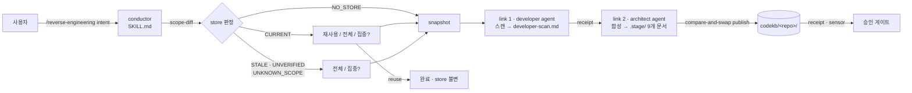

# reverse-engineering — 코드베이스를 9개 문서의 Code KB로 만드는 스킬

> **대상 스킬**: `reverse-engineering` — AI-DLC v2(`aidlc-workflows`)의 reverse-engineering 스테이지를
> 워크플로 없이 단독으로 돌릴 수 있게 발췌한 스킬. 하나의 하네스 중립 소스에서 Claude Code · Kiro CLI ·
> Kiro IDE · Codex · Cursor · opencode · Copilot 7종 배포판을 생성한다.
>
> **이 폴더의 구성**
>
>
> | 경로                        | 내용                                                                             |
> | ------------------------- | ------------------------------------------------------------------------------ |
> | `core/`                   | 하네스 중립 소스. SKILL.md(conductor), 에이전트 페르소나 2개, 지식 4개, 템플릿 8개, 결정적 툴 `codekb.ts` |
> | `harness/<name>/`         | 하네스별 어댑터 (설치 경로, 위임 방식, 질문 렌더링)                                                |
> | `build.ts`, `dist/`       | `bun build.ts` 로 생성한 14개 배포판 (하네스 7종 × 프로젝트 로컬/사용자 전역)                         |
> | `measurements/`           | 도입 전후 실측 로그, 채점 스크립트, 재실행 가드 재현 스크립트                                           |
> | `examples/ticket-triage/` | 측정에 쓴 샘플 레포 + 스킬이 발행한 `codekb/` + 스킬 없이 만든 대조군 `docs-baseline/`                |
> | `README.md`               | 설치·호출·제거 안내 (하네스별)                                                             |
>

## 1. 해결하려는 문제 및 적용 맥락

**문제 1 — "이 코드 분석해줘"는 매번 다른 것을 만든다.** 기존 코드베이스에 기능을 얹기 전에  
에이전트에게 구조를 파악시키면, 그때그때 다른 파일 구성, 다른 깊이의 문서가 나온다. 무엇을 실제로  
읽고 썼는지, 무엇을 짐작으로 썼는지가 문서에 남지 않는다. 다음 사람(또는 다음 세션)은 그 문서를  
믿어도 되는지 판단할 근거가 없다.

**문제 2 — 재실행이 이전 지식을 덮어쓴다.** 코드가 바뀐 뒤 다시 돌리면 기존 문서를 통째로
다시 쓰거나, 반대로 낡은 문서를 그대로 둔 채 새 내용을 덧붙여 서로 모순되는 서술이 공존한다.
"이 문서가 지금 코드와 맞는가"를 기계적으로 판정할 방법이 없다.

**문제 3 — 좋은 해법이 무거운 워크플로 안에 갇혀 있다.** AI-DLC v2의 reverse-engineering 스테이지는
위 두 문제를 이미 풀고 있다. developer 에이전트가 스캔하고 architect 에이전트가 9개 문서로 합성하며,
`reverse-engineering-timestamp.md`의 `Scope of Analysis` 블록에 깊게 읽은 경로와 컴포넌트를
기계 판독 가능하게 남기고, 재실행 시 지문을 대조해 재사용/전체 재스캔/집중 스캔을 묻는다.
그런데 이 스테이지를 쓰려면 `.claude/` 250개 파일, 훅 17개, 센서 6개, intent 레코드가 있는
v2 워크스페이스 전체가 필요하다. Kiro CLI용 `.kiro/`, Cursor용 `.cursor/` 는 각각 따로 빌드해야 한다.
"기존 레포에 기능 하나 얹기 전에 30분만 구조를 파악하고 싶다"는 상황에 워크플로 전체는 과하다.

**적용 맥락.** 개인 프로젝트(billion-dollar-baby, Python 20,900줄 + TypeScript 55,300줄)에서 AI-DLC v2로
개발하며 이 스테이지를 두 번 실행했다 (2026-08-18 프론트엔드 한정, 2026-08-20 대시보드 계층 한정).
두 번째 실행에서 스테이지가 찾아낸 결함 두 건(RE-1: 본전 거래가 모든 지표에서 누락, RE-2: 최대 낙폭의
단위 혼동)이 그대로 설계 결정이 됐다. 이 가치를 v2 워크스페이스 밖에서, 팀원들이 쓰는 어떤 하네스에서든
꺼내 쓰기 위해 스테이지를 단독 스킬로 발췌했다. 같은 실행에서 겪은 두 가지 문제 — 서브에이전트 spawn이
메모리 부족으로 세 번 거부되어 두 링크를 한 컨텍스트에서 돌린 것, 부분 스캔인데 전체 레포 store를 써야
했던 것 — 는 스킬의 **inline fallback** 과 **focused scan 병합 규칙**의 직접적인 동기다.

## 2. 적용 Use Case

### 호출

```
/reverse-engineering <이 코드베이스에서 하려는 일>   [--repo a,b] [--depth Minimal|Standard|Comprehensive] [--focus <paths>]
```

예: `/reverse-engineering add CSV export to the triage API --focus services/api/`

### 파이프라인



### UC-1. 레거시 레포 첫 온보딩

처음 보는 레포에서 `/reverse-engineering initial onboarding` 을 실행한다. 스킬은 브라운필드인지
한 줄로 확인하고(`pyproject.toml`, `package.json` 등의 존재), store가 없으므로 질문 없이
스냅샷을 찍고 developer → architect 두 링크를 돌려 `codekb/<repo>/` 에 9개 문서를 발행한다.
승인 게이트에서 문서 경로와 센서 결과(필수 섹션 존재 여부)를 보고 Approve / Request Changes 를 고른다.
`codekb/<repo>/` 는 커밋하고, `codekb/.record/` 는 실행 장부이므로 gitignore 한다.

### UC-2. 기능 추가 전 부분 갱신 (focused scan)

이미 store가 있는 레포에서 새 기능 작업 전에 다시 호출한다. `scope-diff` 가 store에 기록된 지문과
현재 소스의 지문(git 트리 해시)을 대조해 CURRENT / STALE 을 판정하고, 사람에게 **재사용 · 전체 재스캔 ·
집중 스캔** 을 묻는다. 집중 스캔을 고르면 intent의 영역만 깊게 읽고, 나머지 서술은 보존하되
검증되지 않은 깊은 커버리지는 `shallow` 로 강등한다. 새 scope가 이전보다 좁으면 발행 전에
**NARROWER** 경고와 강등 목록을 반드시 보여 준다.

### UC-3. 멀티 레포 프로젝트

`--repo api,worker` 처럼 하위 디렉터리 단위로 store를 따로 만든다. 레포별 developer 링크는 병렬
dispatch 가 가능하고, 한 레포의 두 링크는 항상 순차다.

### UC-4. 하네스가 섞인 팀

소스는 `core/` 하나다. `bun build.ts` 가 `harness/<name>/harness.json` (설치 경로, 호출 방식,
에이전트 파일 포맷) 과 두 annex(`dispatch.md` 위임 방식, `question-rendering.md` 질문 렌더링)를
읽어 하네스별 배포판을 만든다. `bun build.ts --check` 는 소스와 배포판의 바이트 단위 드리프트를
잡는다. 팀원은 자기 하네스의 `dist/<name>/` 만 프로젝트 루트(또는 홈)에 병합하면 된다.


| harness           | 위임 메커니즘                 | 질문 렌더링                       | 호출                     |
| ----------------- | ----------------------- | ---------------------------- | ---------------------- |
| claude            | Agent 툴 `subagent_type` | AskUserQuestion              | `/reverse-engineering` |
| kiro / kiro-ide   | `subagent` 툴            | 번호 목록                        | `/reverse-engineering` |
| codex             | `spawn_agent` role      | `request_user_input` → 번호 목록 | `$reverse-engineering` |
| cursor / opencode | `task` 툴                | 번호 목록                        | `/reverse-engineering` |
| copilot           | 커스텀 에이전트 호출             | 번호 목록                        | `/reverse-engineering` |


위임 툴이 없는 세션에서는 모든 하네스의 `dispatch.md` 가 **inline fallback** 을 지정한다. conductor 가
페르소나와 지식을 직접 읽고 같은 파일(handoff, 스테이징 후보)을 쓰고 같은 영수증을 발급한다.

### UC-5. 결정적 툴만 단독 사용 (LLM 불필요)

`codekb.ts` 는 스킬과 분리해 CLI로 쓸 수 있다. 예를 들어 CI에서 `scope-diff` 를 돌려 "코드가 바뀌었는데
codekb가 STALE" 인 PR에 경고를 붙이거나, `sensor --dir codekb/<repo>/` 로 필수 섹션 누락을 검사할 수 있다.

```
bun <skill>/scripts/codekb.ts scope-diff --repo api --json
bun <skill>/scripts/codekb.ts sensor --dir codekb/api/
```

## 3. 도입 전후의 차이

### 측정 설계

같은 코드베이스, 같은 요청 문구로 **스킬 없이(BEFORE)** 와 **스킬로(AFTER)** 각각 실행하고, 산출 문서를
같은 기계적 채점기(`measurements/score.ts`)로 쟀다. 대상은 측정용으로 만든 샘플 레포
`ticket-triage` (FastAPI API + Redis 큐 워커 + 공유 도메인 패키지, 23파일 / 433 LOC, 읽기·쓰기 경로 단절이나
Dockerfile 부재 같은 결함을 의도적으로 심어 둠). 하네스는 Claude Code. AFTER 는 두 번 돌렸다 (Run A: depth Standard, Run B: 별도 세션에서
스킬을 자율 발견해 실행, depth Comprehensive — 재현성 확인용).

### 결과


| 지표                             | BEFORE (스킬 없음) | AFTER Run A              | AFTER Run B |
| ------------------------------ | -------------- | ------------------------ | ----------- |
| 생성 문서                          | 4 (index + 3)  | **9**                    | **9**       |
| 정규 산출물 9종 중 존재                 | 0              | 9                        | 9           |
| 총 줄 수                          | 513            | 1,511                    | 2,304       |
| `##` 섹션                        | 18             | 32                       | 47          |
| Mermaid 다이어그램                  | 0              | 6                        | 7           |
| 소스 파일 인용 (`services/…py` 등)    | 10             | 94                       | 102         |
| 기계 판독 가능한 Scope of Analysis 블록 | 없음             | 있음 (`kind: full`, 지문 기록) | 있음          |
| 링크 영수증 (developer / architect) | 없음             | 2 / 2 (SHA-256 바인딩)      | 2 / 2       |
| 소요 (에이전트 시간)                   | 미측정            | 666s (스캔 156s + 합성 511s) | 1,438s      |
| 서브에이전트 토큰                      | 미측정            | 147,326                  | 163,209     |


BEFORE 의 `docs/README.md` 는 01~~09 문서 9개를 링크했지만 실제로 만들어진 것은 01~~03 세 개였다.
"만들겠다고 한 것" 과 "만든 것" 의 차이를 문서 자체가 드러내지 않는다는 점이 문제 1 그대로다.
AFTER 는 두 링크 모두 영수증이 있어야 완료로 보고되고, 영수증은 handoff 파일의 SHA-256에 묶이므로
사후 편집이 있으면 무효가 된다.

내용 면에서는 세 실행 모두 핵심 결함 두 건(API 읽기 경로가 워커의 쓰기 경로와 단절, CI와 Compose가
참조하는 Dockerfile 부재)을 찾아냈다. BEFORE 는 본문에서 Q-3 · Q-4 · Q-6 · Q-9 같은 추가 결함도
언급했지만, 그 근거가 실릴 `08-code-quality.md` 는 생성되지 않았다. 미선언 `psycopg` 드라이버는
AFTER 두 실행만 찾았다. 차이는 **찾아낸 것을 어디에 어떤 형식으로 남기느냐** 에 있다. AFTER 는
`code-quality-assessment.md` 에 file:line 근거와 함께, `reverse-engineering-timestamp.md` 에는
"이번 실행이 실제로 깊게 읽은 것" 을 남긴다.

### 재실행 가드 (결정적, LLM 없음)

`measurements/guard-demo.sh` 는 발행된 store 위에서 다음을 재현한다. 출력은 `rerun-guard.txt`.

1. 소스 변경 없음 → `CURRENT` (store 지문 == 현재 지문)
2. 파일 하나 추가 → `STALE`
3. 이전보다 좁은 scope로 compare → `NARROWER` 경고 + 강등될 경로·컴포넌트 목록
4. 낡은 store 세대로 publish → `CODEKB_STORE_CHANGED` 거부
5. 낡은 소스 지문으로 publish → `CODEKB_SOURCE_CHANGED` 거부
6. 모든 거부 후 store 무손상 (`CURRENT` 로 복귀)

이 스크립트는 제출 폴더의 `examples/ticket-triage/` 를 임시 디렉터리에 복사해 돌리므로 누구나
`bash measurements/guard-demo.sh` 로 같은 결과를 볼 수 있다 (bun, git 필요).

### 원본 워크플로 대비


|                                      | AI-DLC v2 스테이지                                          | 이 스킬                                            |
| ------------------------------------ | ------------------------------------------------------- | ----------------------------------------------- |
| 전제                                   | v2 워크스페이스 전체 (`.claude/` 250파일, 훅 17, 센서 6, intent 레코드) | 스킬 디렉터리 + 에이전트 파일 2개, `bun`, `git`              |
| 산출 위치                                | `aidlc/spaces/<space>/codekb/<repo>/`                   | `codekb/<repo>/`                                |
| 하네스                                  | 하네스별 배포판을 원본 저장소가 제공                                    | 소스 1개 → 7 하네스 × 로컬/전역 14 배포판, `--check` 드리프트 가드 |
| 위임 불가 세션                             | 스테이지가 막힘 (실제로 겪음)                                       | inline fallback 으로 같은 파일·영수증                    |
| 재실행 판정, CAS publish, NARROWER, 강등 규칙 | 있음                                                      | **동일** (`codekb.ts` 로 이식)                       |


### 이 수치를 읽을 때 주의할 점

- 각 조건 **1회(AFTER 는 2회)** 실행이다. 통계적 비교가 아니라 "같은 조건에서 어떤 형태의 결과가 나오는가" 의 관찰이다.
- 채점기는 **개수를 센다**. 줄 수·섹션 수·인용 수가 많다고 문서가 더 정확한 것은 아니다. 정확성은 심어 둔 결함을 찾았는지로 봤고, 핵심 결함에 한해서는 BEFORE 도 잘 찾았다.
- BEFORE 가 문서 3개에서 멈춘 원인(컨텍스트, 턴 제한, 모델 판단)은 분리하지 못했다.
- BEFORE 의 소요 시간과 토큰은 기록하지 못했다.

## 4. 적용 시 제약 사항 또는 주의점

**비용.** 433 LOC 샘플에서 한 번에 15만 토큰 안팎, 11~24분이 든다. 큰 레포에서 전체 재스캔은 그에
비례해 늘어난다. 두 번째부터는 `--focus` 로 집중 스캔을 쓰는 것이 전제다. 첫 실행이 부담되면
`--depth Minimal` 로 9개 문서의 골격만 만든 뒤 집중 스캔으로 채워 가는 편이 낫다.

**전제 조건.** `bun` 과 `git` 이 PATH 에 있어야 한다. 지문은 git 임시 인덱스의 트리 해시로
계산하므로 git 저장소가 아니면 바이트 트리 해시 폴백을 쓴다 (동작은 하지만 `.gitignore` 를 존중하지 않는다).

**브라운필드 판정은 프로즈 규칙이다.** 빈 레포에서 conductor 가 규칙을 무시하면 툴은 막지 않는다.
거의 빈 문서 9개가 `fingerprint: unknown` 으로 발행되고 다음 실행은 UNVERIFIED 가 된다.

**inline fallback 은 파이프라인의 독립성을 잃는다.** 두 링크의 가치는 "스캔한 쪽과 다른 컨텍스트가
합성한다" 에 있다. 위임 툴이 없는 세션에서는 파일과 영수증 계약은 지켜지지만 그 독립성은 없다.
billion-dollar-baby 에서 실제로 겪었고, 스테이지 memory 에 Deviation 으로 남겼다. Run B 의 툴 호출
706회는 이 경로로 돌았을 때의 비용이다.

**하네스별 검증 수준이 다르다.** 측정은 Claude Code 에서 했다. 나머지 6종은 배포판 생성, 설치
경로, 에이전트 파일 포맷, `codekb.ts help` 까지 확인한 수준이며 각 하네스에서 파이프라인 전체를
같은 조건으로 재측정하지는 않았다. Codex 는 구조화 질문에 `experimental_request_user_input` 설정이
필요하고 없으면 번호 목록으로 떨어진다. Kiro IDE 는 `~/.kiro/` 아래 심볼릭 링크를 따라가지 않으므로
전역 설치는 실제 복사여야 한다. Kiro/Codex 의 에이전트 권한(허용 명령, 쓰기 경로)은 보수적으로 잡아
두어 스캔 중 다른 셸 명령이 필요하면 하네스가 확인을 요청한다.

**문서 형식은 고정이다.** 9개 문서와 각 문서의 `##` 골격은 AI-DLC v2 codekb 와 호환되도록 그대로
두었다. 다른 구조를 원하면 `core/templates/` 와 `re-artifacts.md` 를 고치고 `bun build.ts` 로 다시
생성해야 한다. `dist/` 를 직접 고치면 `--check` 가 실패한다.

**센서는 권고다.** `sensor` 는 필수 섹션의 존재만 본다. 내용의 정확성은 승인 게이트에서 사람이
`codekb/<repo>/` 를 읽고 판단해야 한다. 발행된 store 는 커밋 대상이므로 리뷰 없이 올리지 않는다.

**동시 실행.** 같은 레포에 두 세션이 동시에 발행하면 나중 쪽이 `CODEKB_STORE_CHANGED` 로 거부된다.
거부는 store 를 건드리지 않지만, 거부된 쪽은 새 store 를 읽고 다시 병합해야 한다. 스테이징 후보를
수동으로 store 에 복사하는 우회는 지문 불일치를 남기므로 하지 않는다.

## 출처 표기

- **AI-DLC v2 (`aidlc-workflows`, v2 브랜치)** — [https://github.com/awslabs/aidlc-workflows/tree/v2](https://github.com/awslabs/aidlc-workflows/tree/v2) ,
Amazon.com, Inc., **MIT-0**. 이 스킬의 원본. 가져온 것: reverse-engineering 스테이지 프로즈
(`core/aidlc-common/stages/inception/reverse-engineering.md`), developer/architect 에이전트 페르소나,
지식 3종 (`code-analysis-guide.md`, `re-artifacts.md`, `architecture-patterns.md`), 9개 산출물 형식과
Scope of Analysis 블록, 재실행 판정 5종 · CAS publish · NARROWER · 강등 규칙의 의미론.
**본인 수정·추가 범위**: 워크플로 의존을 제거한 단독 SKILL.md(conductor), `aidlc-utility.ts` /
`aidlc-log.ts` / `aidlc-state.ts` / required-sections 센서를 한 파일로 이식한 `codekb.ts` (835줄),
하네스 어댑터 7종 (`harness/`, `dispatch.md` inline fallback 포함), 질문 렌더링 annex, 빌드·드리프트
가드 `build.ts`, 템플릿 8종 분리, `re-synthesis-checklist.md`, 측정 스크립트와 샘플 레포.
- **샘플 레포 `examples/ticket-triage/`** — 측정용으로 직접 작성한 합성 코드베이스. 실제 서비스나
고객 코드가 아니다. 그 안의 `codekb/` 와 `docs-baseline/` 은 각각 스킬 실행과 대조군 실행이 생성한
문서 원본이며, 로컬 절대 경로만 `<workspace>` / `<home>` 으로 치환했다.

